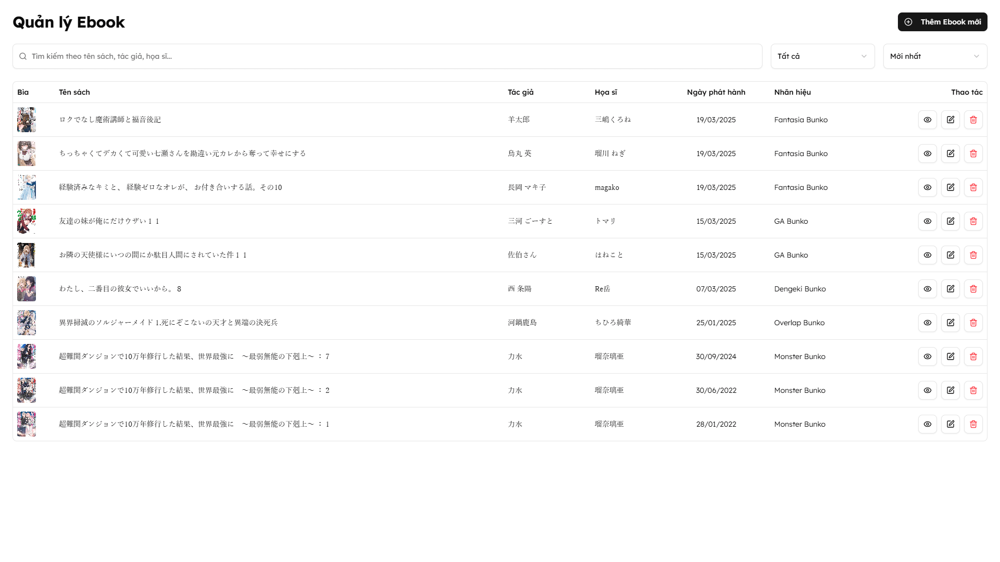
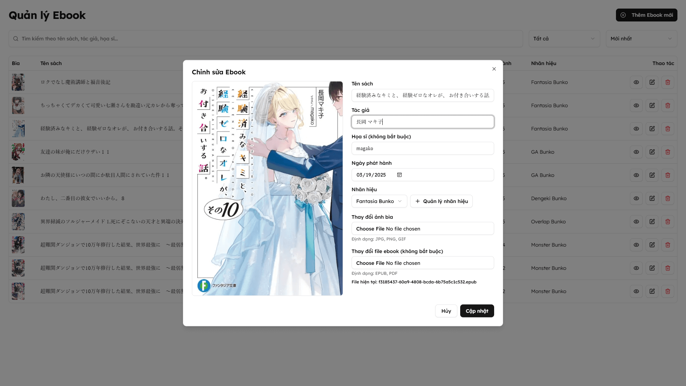

<p align="center">
    
</p>

<h2 align="center"> Ranobe Reader </h2>

<h4 align="center"> A modern web application for reading light novels with a beautiful UI and smooth reading experience.</h4>

<p align="center">
    
    
</p>

### Overview

Ranobe Reader is a full-stack web application that allows users to read light novels with a modern, responsive interface. The application features a clean design, smooth reading experience, and user-friendly navigation.

### Preview






### Tech Stack

#### Frontend

- Next.js 15
- React 19
- TypeScript
- Tailwind CSS
- Radix UI components
- React Hook Form
- Zod for validation

#### Backend

- Node.js
- Express.js
- MongoDB with Mongoose
- JWT for admin authentication
- Multer for file uploads
- Express Rate Limiting
- CSRF protection
- Bibi for EPUB reader

### Getting Started

#### Installation

1. Clone the repository

```bash
git clone https://github.com/yourusername/ranobe-reader.git
cd ranobe-reader
```

2. Install backend dependencies

```bash
cd backend
npm install
```

3. Install frontend dependencies

```bash
cd ../frontend
npm install
```

4. Set up environment variables

- Copy `.env.example` to `.env` in both backend and frontend directories
- Update the environment variables with your configuration

5. Start the development servers

Backend:

```bash
cd backend
npm run dev
```

Frontend:

```bash
cd frontend
npm run dev
```

The application will be available at:

- Frontend: http://localhost:3000
- Backend: http://localhost:3001

### Project Structure

```
ranobe-reader/
├── backend/
│   ├── config/         # Configuration files
│   ├── controllers/    # Route controllers
│   ├── middleware/     # Custom middleware
│   ├── models/        # Database models
│   ├── routes/        # API routes
│   ├── uploads/       # File uploads
│   └── server.js      # Main server file
└── frontend/
    ├── app/           # Next.js app directory
    ├── components/    # Reusable components
    ├── lib/          # Utility functions
    └── public/       # Static assets
```
